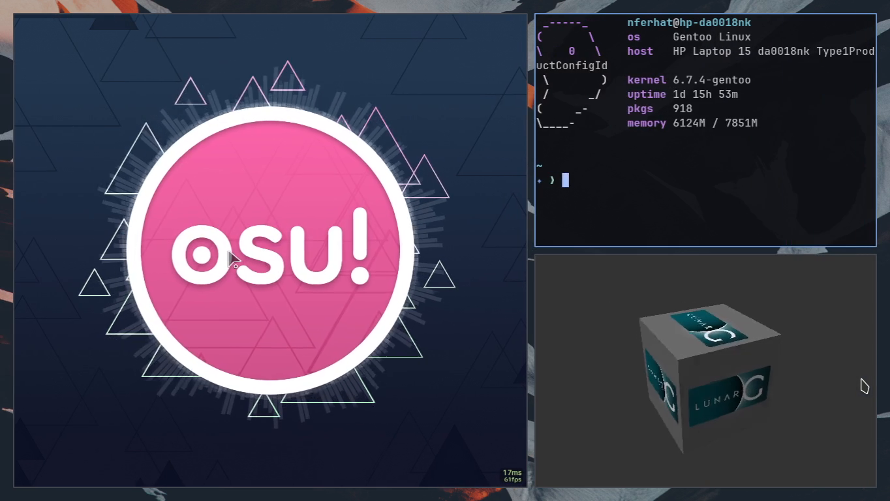

# fht-compositor



fht-compositor is a wayland compositor that aims to have simple window management that is easy to
understand and get accomodated to, inspired by X11 window managers, mainly DWM and AwesomeWM.

Every output has its workspace set, each consituting of 9 workspaces. When using keybinds,
their effects are scoped to the active output, and if needed, the active workspace, and the active
workspace window.

Each workspace provides a *dynamic tiling* layout (currently supporting bottom stack and tile), with
support for floating windows if needed. Note that there is *no distinction* between floating and
tiled windows, and there's no such concept as a floating and tiled layer. Floating windows preserve
their last place in the tiling list when un-floated.

## Features

- Can be ran user an X11 window, or under a TTY.
- Workspaces, layouts, floating windows.
- Some basic animations (workspace switching)
- Window borders, with ronded corners support
- Configuration:
- D-bus based IPC (see [IPC](#-IPC) below)
    - Input configuration (global and per-device), with both keybinds and mousebinds.
    - Window rules (based on title/app_id/current workspace/etc.)
- Output Screencast/Screen recording support through the XDG ScreenCast portal interface.

## TO-DOs

- Xwayland support (very unlikely, but you can use a Xwayland rootful window)
- Session lock support

## IPC

fht-compositor exposes an IPC under the `fht.desktop.Compositor` service name. It exposes the
following objects for you to query

> TIP: You can use something like `d-spy` to inspect the IPC interface.

- `/fht/desktop/Compositor` (`fht.desktop.Compositor.Ipc`): Global IPC
- `/fht/desktop/Compositor/Output/{name}` (`fht.desktop.Compositor.Output`): Exposed IPC output.
  - `/fht/desktop/Compositor/Output/{name}/Workspaces/{0..9}` (`fht.desktop.Compositor.Workspace`): Workspaces for exposed IPC output.

## Install

1. Building

```sh
cargo build --release
# Or, if you want to customize features (see Cargo.toml)
cargo build --no-default-features --features=egl,udev_backend --release

# Optional, if you want xdg-screencast-portal feature
cd ../fht-share-picker
cargo build --release
```

2. Installing required files

```sh
cp target/release/fht-compositor /somewhere/inside/PATH

# Optional, if you want xdg-screencast-portal feature
cp res/fht-compositor.portal $XDG_CONFIG_HOME/xdg-desktop-portal/portals/
cd ../fht-share-picker
cp target/release/fht-share-picker /somewhere/inside/PATH
# You can also configure portals.conf(5) (see man page), but it should work by default.
```

3. Running. Note that fht-compositor *should* write a starter configuration inside `$XDG_CONFIG_HOME/fht/compositor.ron`, if not, you can copy over [`res/compositor.ron`](./res/compositor.ron) there.
  - When it comes to portals, the compositor *itself* is a portal, meaning that it will expose the required DBus interfaces without any intervention.
